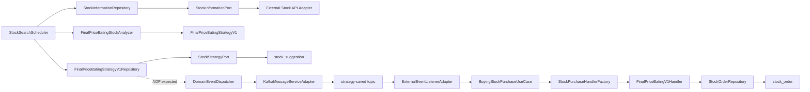

# Strategy Architecture Analysis

## 목적

이 문서는 새 매매 전략을 추가하기 전에 현재 아키텍처의 전략 생성, 이벤트 발행, 주문 생성 흐름을 정리한다. 초점은 `stock-search-service`에서 전략 후보를 만들고, Kafka 이벤트를 통해 `stock-purchase-service`가 주문을 생성하는 경로다.

## 현재 모듈 책임

- `common`: 공통 아키텍처 애노테이션, 도메인 이벤트, 애플리케이션 이벤트, Kafka 토픽, protobuf 변환 유틸을 제공한다.
- `stock-search-service`: 외부 주식 정보 API를 조회하고, 조건을 만족하는 종목을 전략 후보로 저장하며, 전략 생성 이벤트를 발행한다.
- `stock-purchase-service`: 전략 생성 이벤트를 수신하고, 전략 타입에 맞는 매수 주문을 만든 뒤 주문 저장/체결 확인/매도 주문 생성을 담당한다.
- `stock-service`: 기본 주식 정보 관리 예제에 가깝고, 현재 전략 실행 흐름의 중심은 아니다.
- `grpc-proficiency`, `grpc-proficiency-client`: protobuf/gRPC 실험용 모듈이며 현재 전략 흐름과는 분리되어 있다.

## 현재 전략 흐름



### 1. 전략 후보 탐색

- `StockSearchScheduler.finalPriceBatingStrategy1()`이 스케줄 기반으로 실행된다.
- `StockInformationRepository.findTop10VolumeStocks()`가 거래대금 상위 종목을 조회한다.
- `FinalPriceBatingStockAnalyzer.analyzeStocks()`가 기본 조건을 통과한 `Stock`을 `FinalPriceBatingStrategyV1`로 변환한다.
- 이후 프로그램 순매수량, 최근 5거래일 프로그램 순매수 비교 조건을 추가로 필터링한다.
- 최종 후보는 `FinalPriceBatingStrategyV1Repository.saveAll()`로 저장된다.

### 2. 전략 저장과 이벤트 발행

- `FinalPriceBatingStrategyV1RepositoryImpl`은 도메인 전략 객체를 `StockStrategyDTO`로 변환한다.
- `StockStrategyAdapter`는 `StockStrategyDTO`를 `StockSuggestion` JPA 엔티티로 변환해 `stock_suggestion`에 저장한다.
- 의도상 `@EventPublishingRepository`와 `CompleteEntityAspect`가 저장 전 `complete()`를 호출하고, 저장 성공 후 `DomainEventDispatcher`로 이벤트를 발행한다.
- `StockSearchServiceEventMapper`는 `StrategyCreatedEvent`를 `StrategyCreatedApplicationEvent`로 변환한다.
- `KafkaMessageServiceAdapter`는 애플리케이션 이벤트를 `StrategySavedEvent` protobuf 메시지로 직렬화해 `strategy-saved` 토픽에 발행한다.

### 3. 전략 이벤트 수신과 주문 생성

- `stock-purchase-service`의 `ExternalEventListenerAdapter`가 `strategy-saved` 토픽을 소비한다.
- protobuf `StrategySavedEvent`를 `BuyingStockPurchaseCommand`로 변환한다.
- `BuyingStockPurchaseService`는 `StockPurchaseHandlerFactory`에서 전략 타입별 핸들러를 찾는다.
- 현재 구현된 핸들러는 `FinalPriceBatingV1Handler` 하나다.
- 핸들러는 구매 전략 도메인 객체 `FinalPriceBatingV1`을 만들고, `PurchaseOrder`를 생성해 `StockOrderRepository`에 저장한다.

## 현재 구조의 좋은 점

- 전략 탐색 서비스와 주문 서비스가 Kafka 이벤트로 분리되어 있다.
- 외부 API, Kafka, DB 접근을 포트/어댑터로 분리하려는 방향이 명확하다.
- 전략 조건은 도메인 객체와 도메인 서비스로 이동 중이며, 스케줄러가 모든 판단을 직접 들고 있지는 않다.
- ArchUnit으로 계층 의존성 검증을 하려는 기반이 있다.
- protobuf 이벤트 계약을 사용해 서비스 간 메시지 포맷을 명시하려는 방향이 있다.

## 주요 리스크

### 이벤트 발행 AOP가 불안정하다

- `@EventPublishingRepository`는 `FinalPriceBatingStrategyV1Repository` 인터페이스에 붙어 있다.
- `CompleteEntityAspect`는 `@target(com.example.common.domain.event.EventPublishingRepository)` 포인트컷을 사용한다.
- `@target`은 보통 실제 타깃 클래스 애노테이션을 기준으로 매칭하므로, 구현 클래스에 애노테이션이 없으면 동작하지 않을 가능성이 높다.
- `save()`와 `saveAll()`은 `suspend` 함수인데, 코루틴용 `proceedCoroutine()` 헬퍼는 현재 aspect에서 사용되지 않는다.

### 전략 타입이 여러 계층에 중복되어 있다

새 전략 하나를 추가하려면 현재 다음 타입들을 모두 수정해야 한다.

- `stock-search-service.domain.event.StrategyType`
- `stock-search-service.application.event.StrategyTypeDto`
- `stock-search-service.application.port.out.dto.StrategyType`
- `stock-search-service.adapter.out.persistence.entity.StrategyType`
- `common/src/main/proto/event.proto`의 `StrategyType`
- `stock-purchase-service.application.service.StrategyType`
- `stock-purchase-service.domain.StrategyType`
- `stock-purchase-service.application.repository.StrategyTypeDto`
- `stock-purchase-service.adapter.out.persistence.entity.StrategyType`

이 중복은 새 전략 추가 시 누락과 매핑 오류를 만들 가능성이 크다.

### 이벤트 페이로드가 주문 생성에 부족하다

- `StrategySavedEvent`에는 `stock_id`, `stock_name`, `saved_at`, `type`, `meta`만 있다.
- `event.proto`에도 `targetPrice`가 필요하다는 TODO가 있다.
- 현재 `ExternalEventListenerAdapter.toCommand()`는 `purchasePrice = 0.0`으로 하드코딩한다.
- `FinalPriceBatingV1.calculateQuantity()`는 `DEFAULT_BUY_TOTAL_AMOUNT / purchasePrice.price`를 사용하므로, 가격이 0이면 주문 수량 계산이 깨진다.
- 전략을 실제로 적용하려면 최소한 목표 매수가, 기준가, 신호 생성 사유, 전략 파라미터 버전이 이벤트나 저장소에 있어야 한다.

### 전략 실행 정책이 검색 전략과 구매 전략에 분리되어 있지만 계약이 약하다

- `stock-search-service.domain.strategy.FinalPriceBatingStrategyV1`은 후보 판별과 전략 생성 이벤트를 담당한다.
- `stock-purchase-service.domain.FinalPriceBatingV1`은 매수/매도 주문 정책을 담당한다.
- 이름은 같지만 의미가 다르다. 하나는 “신호 생성 전략”, 다른 하나는 “주문 실행 전략”이다.
- 두 서비스 사이 계약이 현재 `StrategyType`과 `stockId` 중심이라, 같은 전략 버전의 파라미터를 양쪽에서 일관되게 재현하기 어렵다.

### 핸들러 팩토리가 OCP에 약하다

- `StockPurchaseHandlerFactory`가 구체 핸들러 타입을 `when`으로 검사한다.
- 새 전략 핸들러를 추가할 때 팩토리 코드도 계속 수정해야 한다.
- 핸들러가 직접 `strategyType`을 노출하도록 만들면 등록 로직을 일반화할 수 있다.

### 아직 실행 경로에 미구현 지점이 많다

- `StockInformationAdapter`의 여러 조회 메서드가 `TODO("Not yet implemented")` 상태다.
- `MarketServiceAdapter.findExecutionListAtOneDay()`, `SellStockHandler.execute()`, `BuyStockHandler.execute()` 일부가 미구현 상태다.
- `StockOrderRepositoryImpl.findAllWithPurchaseWaiting()`가 미구현이라 `simulateStockPurchase()` 경로가 깨질 수 있다.
- `FinalPriceBatingV1.createSellingOrder()`의 `orderState = TODO()`는 매도 주문 생성 시 즉시 실패한다.
- `Order.project()` 계열은 `copy()` 결과를 반환하지 않아 상태 변경이 실제 객체에 반영되지 않는다.

## 전략 추가 전 정리해야 할 설계 포인트

### 1. 전략 개념을 둘로 명확히 분리한다

- `DiscoveryStrategy`: 어떤 종목을 왜 후보로 선정했는지 결정한다.
- `TradeStrategy`: 후보 신호를 받아 어떤 가격/수량/조건으로 매수·매도할지 결정한다.

현재 이름이 같은 `FinalPriceBatingV1`이 두 서비스에서 다른 역할을 하므로, 문서와 코드 네이밍에서 이 차이를 먼저 고정하는 것이 좋다.

### 2. 전략 이벤트 계약을 먼저 확정한다

새 전략을 바로 추가하기 전에 `StrategySavedEvent`를 다음 정보를 담을 수 있게 확장하는 것이 안전하다.

- `strategy_type`
- `strategy_version`
- `stock_id`
- `stock_name`
- `signal_at`
- `target_purchase_price`
- `reference_price`
- `rank`
- `reason_codes` 또는 `metrics`
- `meta`

전략별 파라미터가 계속 달라질 수 있다면 protobuf `oneof` 또는 `bytes/json payload` 방식 중 하나를 선택해야 한다.

### 3. 전략 타입 매핑을 중앙화한다

- 가능하면 `common` 또는 protobuf enum을 기준 타입으로 삼고, 각 모듈의 도메인 타입은 얇은 변환 계층만 둔다.
- 최소한 매핑 로직은 한 파일에 모아야 한다.
- 새 전략 추가 체크리스트에 enum, proto, persistence, event mapper, handler registration을 명시해야 한다.

### 4. 전략 실행 핸들러 등록을 일반화한다

현재 팩토리 대신 다음 형태가 더 확장에 유리하다.

```kotlin
interface StockPurchaseHandler<T : BuyingStockPurchaseCommand> {
    val strategyType: StrategyType
    suspend fun handle(command: T): BuyingStockPurchaseResult
}
```

팩토리는 `handlers.associateBy { it.strategyType }`만 수행한다. 그러면 새 전략 추가 시 팩토리 수정이 사라진다.

### 5. 스케줄러에서 전략 유스케이스를 분리한다

`StockSearchScheduler`는 현재 데이터 조회, 필터링, 저장을 직접 조합한다. 전략이 늘어나면 스케줄러가 전략 오케스트레이션 코드로 비대해진다.

권장 구조:

```text
application/service
  RunStockDiscoveryUseCase
  StrategyDiscoveryRunner
domain/strategy
  DiscoveryStrategy
  FinalPriceBatingV1DiscoveryStrategy
```

스케줄러는 시간 트리거만 담당하고, 실제 전략 실행은 유스케이스로 위임한다.

### 6. 저장 모델에 전략 파라미터를 남긴다

현재 `stock_suggestion`은 `stockId`, `dateTime`, `strategyType` 중심이다. 새 전략이 추가되면 “왜 선정되었는지”, “어떤 가격으로 주문해야 하는지”를 복원하기 어렵다.

최소 추가 후보:

- `strategyVersion`
- `signalPrice`
- `targetPurchasePrice`
- `rank`
- `metadata` 또는 `metrics`
- `createdAt`
- `status`

## 새 전략 추가 최소 경로

현재 구조를 크게 바꾸지 않고 전략을 하나 더 추가한다면 다음 순서가 가장 현실적이다.

1. `common/src/main/proto/event.proto`에 새 전략 enum과 필요한 주문 입력 필드를 추가한다.
2. `stock-search-service`에 새 discovery 전략 도메인 객체와 analyzer를 추가한다.
3. `StockSearchScheduler`에는 임시로 새 전략 실행 메서드를 추가하되, 이후 유스케이스로 분리할 것을 전제로 둔다.
4. `StockStrategyDTO`, `StockSuggestion`, 관련 enum 매핑에 새 전략 타입을 추가한다.
5. `StrategyCreatedEvent`와 `StockSearchServiceEventMapper` 매핑을 확장한다.
6. `KafkaMessageServiceAdapter`의 protobuf 변환을 확장한다.
7. `stock-purchase-service`에 새 `BuyingStockPurchaseCommand` 하위 타입을 추가한다.
8. `ExternalEventListenerAdapter.toCommand()`에서 새 이벤트 타입을 새 command로 변환한다.
9. 새 `StockPurchaseHandler`를 구현하고 `StockPurchaseHandlerFactory` 등록 구조를 함께 개선한다.
10. `Orders`, `OrderDto`, 도메인 `StrategyType` 매핑을 확장한다.
11. discovery 조건 단위 테스트, command 변환 테스트, handler 단위 테스트를 추가한다.

## 권장 우선순위

1. `StrategySavedEvent`에 목표 매수가와 전략 버전을 추가한다.
2. 전략 타입 enum/mapper 중복을 줄인다.
3. 이벤트 발행 AOP가 실제로 동작하는지 검증하고, 필요하면 구현 클래스 애노테이션 또는 명시적 publisher 호출로 바꾼다.
4. `StockPurchaseHandlerFactory`를 핸들러 자기등록 방식으로 바꾼다.
5. `StockSearchScheduler`에서 전략 실행 유스케이스를 분리한다.
6. `stock_suggestion`과 `stock_order`에 전략 파라미터/상태 추적 정보를 남긴다.

## 결론

현재 구조는 “전략 후보 생성 서비스”와 “주문 실행 서비스”를 분리하려는 방향은 좋다. 다만 새 전략을 안정적으로 추가하기에는 전략 타입 중복, 이벤트 페이로드 부족, AOP 기반 이벤트 발행의 불확실성, 미구현 주문 경로가 가장 큰 병목이다.

따라서 특정 전략을 적용하기 전에 전략 이벤트 계약과 handler 확장 구조를 먼저 고정하는 것이 좋다. 이 두 지점을 정리하면 이후 전략 추가는 “검색 조건 구현 → 이벤트 발행 → 구매 핸들러 구현”의 반복 가능한 작업으로 만들 수 있다.
